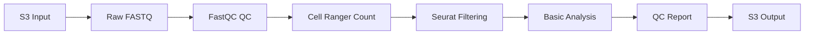

# Single-Cell RNA-seq Analysis Pipeline on AWS

[](https://www.nextflow.io/)
[](https://aws.amazon.com/)
[](https://opensource.org/licenses/MIT)

## Overview

Production-ready single-cell RNA-seq analysis pipeline designed for scalable processing on AWS infrastructure. This pipeline automates the complete workflow from raw FASTQ files to quality-controlled count matrices with basic downstream analysis and visualization.

## Features

- ✅ **Automated Quality Control** - FastQC, Cell Ranger metrics, and Seurat-based filtering
- ✅ **AWS S3 Integration** - Seamless data transfer and storage management  
- ✅ **Nextflow Workflow Management** - Reproducible, scalable pipeline execution
- ✅ **Modular Design** - Easy to maintain, extend, and customize
- ✅ **Comprehensive Documentation** - Clear usage instructions and troubleshooting guides
- ✅ **Test Dataset Included** - Quick validation with provided sample data

## Pipeline Overview



## Quick Start

### Prerequisites
- [Nextflow](https://www.nextflow.io/docs/latest/getstarted.html) (≥22.04.0)
- [AWS CLI](https://aws.amazon.com/cli/) configured with appropriate permissions
- [Conda](https://conda.io/projects/conda/en/latest/user-guide/install/index.html) or [Mamba](https://mamba.readthedocs.io/)

### Installation

```bash
# Clone repository
git clone https://github.com/rinickulous/scRNA-seq-aws-pipeline.git
cd scRNA-seq-aws-pipeline

# Create conda environment
conda env create -f environment.yml
conda activate scrna-pipeline

# Configure AWS (if not already done)
aws configure
```

### Test Run

```bash
# Quick test with included sample data
nextflow run workflows/main.nf -profile test

# Full pipeline with your data
nextflow run workflows/main.nf \
    --input s3://your-bucket/raw-data/ \
    --outdir s3://your-bucket/results/ \
    -profile aws
```

## Input Data

The pipeline expects:
- **Raw FASTQ files** (10X Genomics format: `*_R1_001.fastq.gz`, `*_R2_001.fastq.gz`)
- **Sample sheet** (CSV format with sample metadata)
- **Reference genome** (automatically downloaded or provide custom)

### Sample Sheet Format
```csv
sample_id,fastq_1,fastq_2,expected_cells
sample_1,s3://bucket/sample_1_R1.fastq.gz,s3://bucket/sample_1_R2.fastq.gz,5000
sample_2,s3://bucket/sample_2_R1.fastq.gz,s3://bucket/sample_2_R2.fastq.gz,3000
```

## Output Structure

```
results/
├── fastqc/                    # Quality control reports
├── cellranger/                # Cell Ranger outputs
│   ├── {sample}/
│   │   ├── outs/
│   │   │   ├── filtered_feature_bc_matrix/
│   │   │   └── web_summary.html
├── seurat_qc/                 # Filtered count matrices
├── reports/                   # Combined QC report
└── plots/                     # Visualization outputs
```

## Configuration

### AWS Setup
```bash
# Set up S3 buckets
./scripts/aws/setup_s3_buckets.sh

# Upload test data
./scripts/aws/data_upload.sh data/test_data/ s3://your-input-bucket/
```

### Pipeline Parameters
Key parameters in `config/pipeline.config`:

```nextflow
params {
    // Input/Output
    input = null                    # Path to input directory or samplesheet
    outdir = "./results"           # Output directory
    
    // Reference
    genome = "GRCh38"              # Reference genome
    
    // Cell Ranger
    expected_cells = 3000          # Expected number of cells
    
    // Filtering thresholds  
    min_cells = 3                  # Minimum cells per gene
    min_features = 200             # Minimum genes per cell
    max_mt_percent = 20            # Maximum mitochondrial gene %
}
```

## Documentation

- 📖 [Installation Guide](docs/installation.md)
- 🚀 [Usage Instructions](docs/usage.md) 
- ⚙️ [Configuration Options](docs/configuration.md)
- 🔧 [Troubleshooting](docs/troubleshooting.md)
- ☁️ [AWS Setup Guide](docs/aws_setup.md)

## Testing

```bash
# Run integration tests
./tests/test_pipeline.sh

# Validate outputs
python tests/validate_outputs.py results/
```

## Contributing

1. Fork the repository
2. Create a feature branch (`git checkout -b feature/amazing-feature`)
3. Commit changes (`git commit -m 'Add amazing feature'`)
4. Push to branch (`git push origin feature/amazing-feature`)
5. Open a Pull Request

## License

This project is licensed under the MIT License - see the [LICENSE](LICENSE) file for details.

## Support

- 📧 **Email**: nickk.white@gmail.com
- 🐛 **Issues**: [GitHub Issues](https://github.com/rinickulous/scRNA-seq-aws-pipeline/issues)
- 📚 **Documentation**: [Wiki](https://github.com/rinickulous/scRNA-seq-aws-pipeline/wiki)

## Acknowledgments

- [10X Genomics](https://www.10xgenomics.com/) for Cell Ranger
- [Seurat team](https://satijalab.org/seurat/) for single-cell analysis framework
- [Nextflow](https://www.nextflow.io/) for workflow management
- [nf-core](https://nf-co.re/) for pipeline best practices

---

**Version**: 1.0.0 | **Last Updated**: September 2025